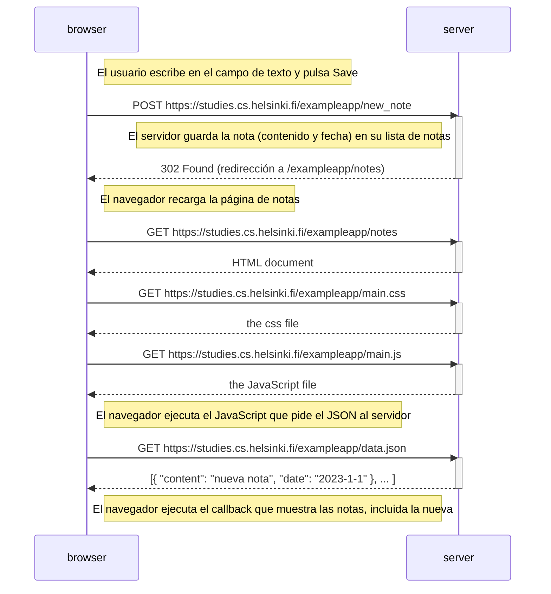
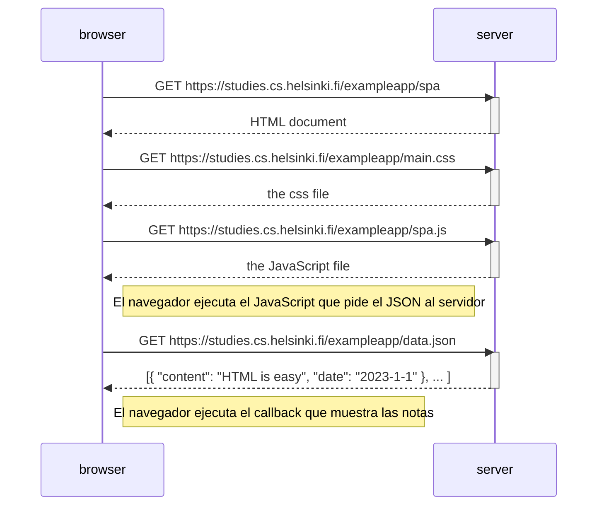
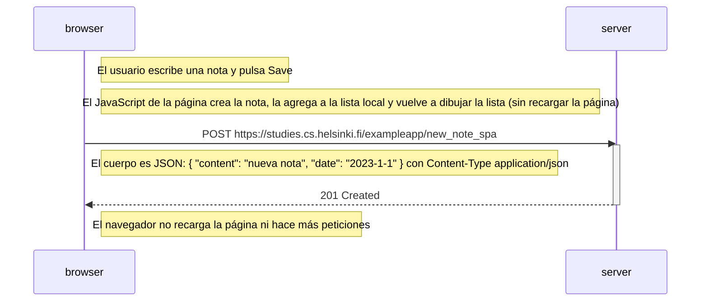

# Parte 0

Los diagramas de abajo corresponden a los ejercicios 0.4 a 0.6 (sintaxis Mermaid).

## 0.4: Nueva nota

```mermaid
sequenceDiagram
    participant browser
    participant server

    Note right of browser: El usuario escribe en el campo de texto y pulsa Save
    browser->>server: POST https://studies.cs.helsinki.fi/exampleapp/new_note
    activate server
    Note left of server: El servidor guarda la nota (contenido y fecha) en su lista de notas
    server-->>browser: 302 Found (redirección a /exampleapp/notes)
    deactivate server

    Note right of browser: El navegador recarga la página de notas

    browser->>server: GET https://studies.cs.helsinki.fi/exampleapp/notes
    activate server
    server-->>browser: HTML document
    deactivate server

    browser->>server: GET https://studies.cs.helsinki.fi/exampleapp/main.css
    activate server
    server-->>browser: the css file
    deactivate server

    browser->>server: GET https://studies.cs.helsinki.fi/exampleapp/main.js
    activate server
    server-->>browser: the JavaScript file
    deactivate server

    Note right of browser: El navegador ejecuta el JavaScript que pide el JSON al servidor

    browser->>server: GET https://studies.cs.helsinki.fi/exampleapp/data.json
    activate server
    server-->>browser: [{ "content": "nueva nota", "date": "2023-1-1" }, ... ]
    deactivate server

    Note right of browser: El navegador ejecuta el callback que muestra las notas, incluida la nueva
```

## 0.5: Aplicación de una sola página (SPA)

```mermaid
sequenceDiagram
    participant browser
    participant server

    browser->>server: GET https://studies.cs.helsinki.fi/exampleapp/spa
    activate server
    server-->>browser: HTML document
    deactivate server

    browser->>server: GET https://studies.cs.helsinki.fi/exampleapp/main.css
    activate server
    server-->>browser: the css file
    deactivate server

    browser->>server: GET https://studies.cs.helsinki.fi/exampleapp/spa.js
    activate server
    server-->>browser: the JavaScript file
    deactivate server

    Note right of browser: El navegador ejecuta el JavaScript que pide el JSON al servidor

    browser->>server: GET https://studies.cs.helsinki.fi/exampleapp/data.json
    activate server
    server-->>browser: [{ "content": "HTML is easy", "date": "2023-1-1" }, ... ]
    deactivate server

    Note right of browser: El navegador ejecuta el callback que muestra las notas
```

## 0.6: Nueva nota en la SPA

```mermaid
sequenceDiagram
    participant browser
    participant server

    Note right of browser: El usuario escribe una nota y pulsa Save
    Note right of browser: El JavaScript de la página crea la nota, la agrega a la lista local y vuelve a dibujar la lista (sin recargar la página)

    browser->>server: POST https://studies.cs.helsinki.fi/exampleapp/new_note_spa
    activate server
    Note right of browser: El cuerpo es JSON: { "content": "nueva nota", "date": "2023-1-1" } con Content-Type application/json
    server-->>browser: 201 Created
    deactivate server

    Note right of browser: El navegador no recarga la página ni hace más peticiones
```
